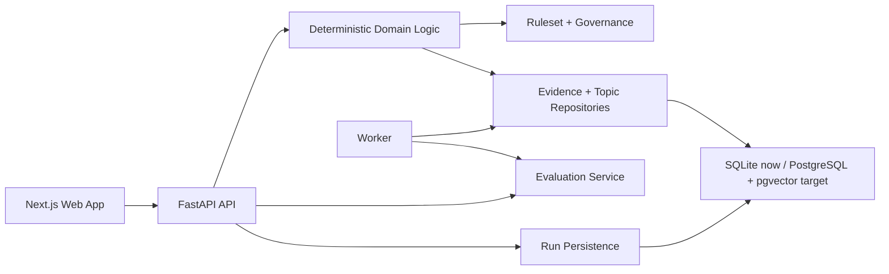
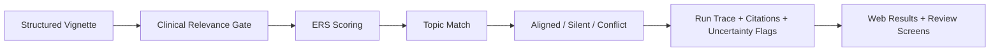

# Lung Cancer Treatment Navigator

Lung Cancer Treatment Navigator is a deterministic evidence triage platform for **NSCLC** case review.  
The goal is to help a reviewer start from a structured patient vignette, retrieve relevant evidence, map that evidence to curated ESMO guideline topics, and present the result with transparent scoring, exclusions, citations, and safety boundaries.

This is **not** a treatment recommendation tool.  
The MVP is intentionally constrained to:

- structured vignette input only
- NSCLC treatment evidence only
- deterministic ranking and mapping logic
- explicit uncertainty and traceability
- benchmark-gated updates using a frozen vignette set

## Project Goal

We are building a working application that can:

1. Accept a structured NSCLC vignette.
2. Retrieve and rank relevant evidence deterministically.
3. Map evidence to curated ESMO guideline topics.
4. Label results as `aligned`, `guideline_silent`, or `conflict`.
5. Show the reasoning path clearly enough for review, debugging, and final presentation.

The project is designed to balance:

- strong UX and visual clarity
- deterministic, auditable logic
- responsible AI boundaries
- evaluation and non-regression discipline

## Architecture

Current implementation direction:

- `apps/web`: Next.js frontend for the product UI, review screens, and lab views
- `apps/api`: FastAPI backend for deterministic analysis, governance, and evaluation
- `apps/worker`: async job scaffold for ingestion and benchmark processing
- `datasets/`: canonical sample data for ESMO topics, PubMed evidence, and frozen vignette fixtures
- `infra/compose`: local PostgreSQL/Redis infrastructure definitions

High-level architecture:



Runtime flow:



## Current Status

Already working:

- full-stack scaffold for `web`, `api`, and `worker`
- deterministic sample run flow from web form to persisted API result
- run detail and trace pages reading real API data
- initial Alembic migration and local persistence for runs and eval runs
- governance policy endpoint and sample benchmark endpoint
- production `next build` passing

Still to do:

- replace sample datasets with real ESMO and PubMed inputs
- build real import pipelines
- complete the full frozen benchmark workflow
- wire reviewer workflow and datasets/eval pages to real stored data
- move from SQLite bootstrap mode to the intended PostgreSQL/pgvector development flow

See [ROADMAP.md](/Users/mario/Repo/mit-cancer-navigator/ROADMAP.md) for the full status breakdown.

## Run Locally

Prerequisites:

- `Node.js` 24+
- `Python` 3.11+
- `uv`
- optional: Docker for local Postgres/Redis

### 1. Install dependencies

```bash
npm install
uv sync --project apps/api
uv sync --project apps/worker
```

### 2. Run the API migration

```bash
npm run migrate:api
```

This creates the local bootstrap database used by the current scaffold.

### 3. Start the web app

```bash
npm run dev:web
```

Web app:

- [http://127.0.0.1:3000](http://127.0.0.1:3000)

### 4. Start the API

```bash
uv run --project apps/api uvicorn app.main:app --host 127.0.0.1 --port 8000
```

API:

- [http://127.0.0.1:8000/health](http://127.0.0.1:8000/health)

### 5. Optional local infrastructure

If you want the intended long-term local stack available:

```bash
docker compose -f infra/compose/docker-compose.yml up -d
```

## Repository Structure

```text
apps/
  web/        Next.js frontend
  api/        FastAPI backend
  worker/     async worker scaffold
datasets/
  esmo/       topic and guideline fixtures
  pubmed/     evidence fixtures
  vignettes/  frozen benchmark fixtures
docs/
  adr/        architecture decisions
  contracts/  contract notes
packages/
  design-tokens/
infra/
  compose/
```

## Notes

- The API currently defaults to a local SQLite database at `apps/api/navigator.db` so the scaffold runs immediately.
- The intended project target remains `PostgreSQL + pgvector`.
- The current corpus is sample data only until the real ESMO and PubMed extracts are imported.
