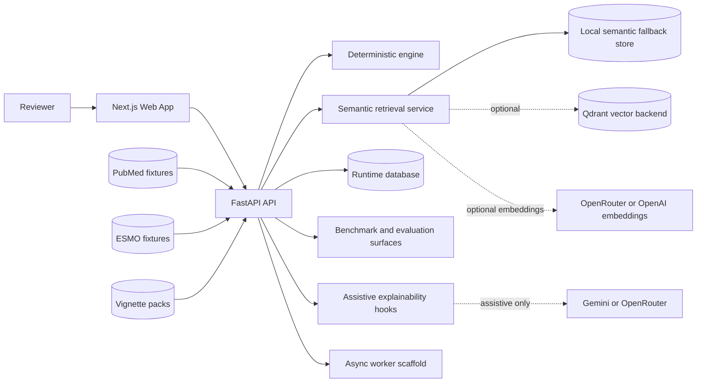
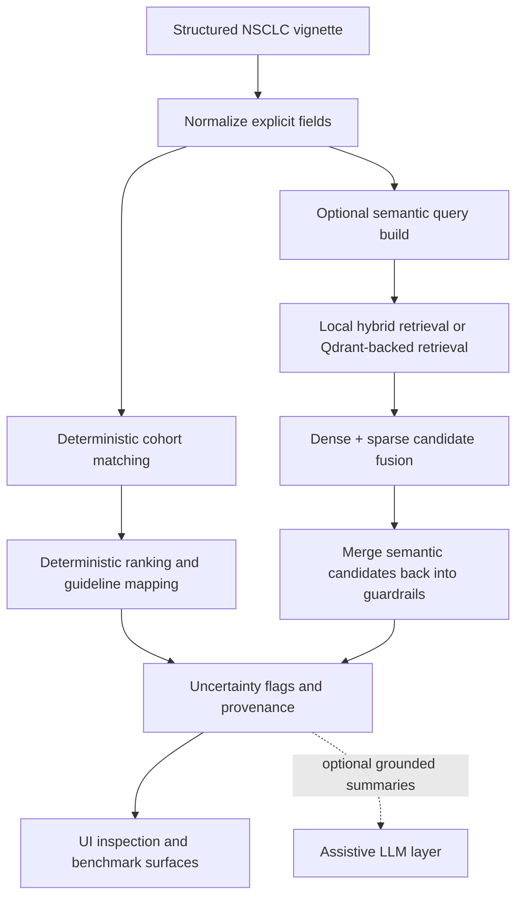

# MIT Cancer Navigator

MIT Cancer Navigator is a research-oriented evidence triage application for **non-small cell lung cancer (NSCLC)** case review.

It was developed as part of an **MIT AIML Group 3** project and is now being prepared as a public repository with a deliberate **responsible AI** posture: explicit limits, visible provenance, deterministic guardrails, and assistive AI only where it improves ergonomics without pretending to be the decision authority.

## What this project is for

The project helps reviewers:

- capture a structured NSCLC vignette
- retrieve relevant evidence and guideline topics
- inspect ranking, exclusions, provenance, and uncertainty
- compare deterministic and hybrid retrieval behavior in a controlled environment

## What this project is not

This repository is **not** a clinical decision system and does **not** prescribe treatment.

It is an engineering and evaluation system for transparent evidence navigation, retrieval experiments, and benchmark analysis.

## License and data usage

- **Code license:** MIT. See [`LICENSE`](./LICENSE).
- **Contribution policy:** See [`CONTRIBUTING.md`](./CONTRIBUTING.md).
- **Community expectations:** See [`CODE_OF_CONDUCT.md`](./CODE_OF_CONDUCT.md).
- **Bundled datasets and fixtures:** current repository data artifacts are included for **proof-of-concept use only** and are **not intended for external or production use**. See [`DATA_USAGE.md`](./DATA_USAGE.md).

## Repository layout

```text
apps/
  api/        FastAPI backend
  web/        Next.js frontend
  worker/     async worker scaffold

datasets/
  esmo/       guideline and topic fixtures
  pubmed/     evidence fixtures
  vignettes/  benchmark fixtures

docs/
  adr/        architecture decisions
  contracts/  contract notes
  data-team/  import and validation workflows

infra/
  compose/    local development services

packages/
  design-tokens/
```

## Stack

- **Frontend**
  - Next.js 15
  - React 19
  - TypeScript
  - React Query
  - React Hook Form
  - Zod

- **Backend**
  - FastAPI
  - Pydantic / pydantic-settings
  - SQLAlchemy
  - Alembic

- **Worker and infrastructure**
  - Python worker scaffold
  - Dramatiq
  - Redis
  - Docker Compose for local supporting services

- **Runtime storage**
  - SQLite bootstrap mode for local fallback
  - PostgreSQL-oriented application structure for runtime persistence

- **Semantic retrieval**
  - local semantic fallback mode
  - optional `Qdrant` external vector backend
  - dense + sparse hybrid retrieval
  - reciprocal-rank style fusion and top-k controls

- **Embeddings**
  - local hash embedding fallback for offline/local operation
  - optional external embeddings through `OpenRouter` or `OpenAI`
  - configurable embedding model via environment variables

- **Assistive LLM hooks**
  - optional grounded explainability / assistive flows
  - current code paths support `Gemini` and selected `OpenRouter` use cases
  - LLM features are **assistive only**, not the clinical authority

- **Deployment shape**
  - Next.js web app
  - FastAPI API
  - Vercel-oriented deployment setup for the web and API surfaces

## Architecture overview



## Runtime philosophy

The system has two cooperating paths:

- **Deterministic path**
  - structured input normalization
  - cohort-fit logic
  - evidence ranking and labeling
  - explicit uncertainty handling
  - provenance and inspectability as the default

- **Hybrid semantic path**
  - chunk-level search over imported evidence and guideline text
  - dense + sparse retrieval experiments
  - optional external vector backend support through `Qdrant`
  - semantic recall lift that feeds back into deterministic guardrails

The intended posture is simple:

- deterministic logic owns the safety-critical visible result
- hybrid retrieval can improve candidate recall
- assistive LLM output can improve explanations
- none of that should be mistaken for free-form clinical authority

## End-to-end retrieval flow



## Current product shape

The repository currently includes two main runtime modes:

- **Deterministic runtime**
  - structured vignette input
  - deterministic evidence scoring and labeling
  - explicit uncertainty and provenance metadata

- **Semantic retrieval lab**
  - raw-text chunk ingestion for PubMed and ESMO content
  - semantic and hybrid retrieval experiments
  - benchmark and explainability support surfaces

## Qdrant and LLM posture

### Qdrant

`Qdrant` is an **optional external vector backend** used by the hybrid retrieval path.

When configured, it can store dense and sparse semantic artifacts for chunk-level retrieval. When it is not configured, the application falls back to the local semantic mode.

Relevant environment variables include:

- `SEMANTIC_VECTOR_BACKEND`
- `QDRANT_URL`
- `QDRANT_API_KEY`
- `QDRANT_COLLECTION_PUBMED`
- `QDRANT_COLLECTION_ESMO`
- `EMBEDDING_PROVIDER`
- `EMBEDDING_MODEL`
- `EMBEDDING_API_KEY`

### LLM

LLM integrations in this repository are **optional and assistive**.

They are used for grounded explainability and related assistive flows, not as the source of truth for treatment logic, ranking authority, or final clinical judgment.

Relevant environment variables include:

- `LLM_PROVIDER`
- `LLM_API_KEY`
- `LLM_MODEL`

## Quick start

### Prerequisites

- Node.js 24+
- Python 3.11+
- `uv`
- Docker optional for local Postgres / Redis

### Install dependencies

```bash
npm install
uv sync --project apps/api
uv sync --project apps/worker
```

### Configure environment

Create a local untracked `.env` from `.env.example` and fill only the values you need.

By default, the repository can run in a more local / fallback posture.
External semantic and LLM integrations are optional.

### Start the API

```bash
npm run migrate:api
npm run dev:api
```

API health endpoint:

- `http://127.0.0.1:8000/health`

### Start the web app

```bash
npm run dev:web
```

Web app:

- `http://127.0.0.1:3000`

### Optional local infrastructure

```bash
docker compose -f infra/compose/docker-compose.yml up -d
```

## Verification

### Backend tests

```bash
npm run test:domain
uv run --project apps/api python -m unittest discover -s apps/api/tests -p 'test_*.py'
```

### Frontend build

```bash
npm --workspace apps/web run build
```

## Datasets and imports

The repository includes sample and curated fixtures under `datasets/`.

Important:

- current bundled dataset artifacts are for **PoC / evaluation use inside this repository**
- they should **not** be treated as a general public dataset release
- they should **not** be used externally without independent provenance and rights review

For dataset validation and import workflows, see:

- `docs/data-team/VALIDATION_WORKFLOW.md`
- `docs/data-team/IMPORT_WORKFLOW.md`
- `docs/data-team/ESMO_DATA_PREP.md`
- `docs/data-team/PUBMED_DATA_PREP.md`
- `DATA_USAGE.md`

## Documentation

- `docs/adr/0001-modular-monolith.md`
- `docs/contracts/overview.md`
- `docs/PROJECT_PLAN.md`
- `docs/ROADMAP.md`
- `docs/STARTUP_CHECKLIST.md`

## Responsible AI stance

This repository aims to be explicit about what AI is doing and what it is **not** doing.

Project expectations:

- prefer inspectable logic over opaque magic
- keep provenance visible
- expose uncertainty instead of smoothing it away
- treat retrieval lift as distinct from decision authority
- keep assistive LLM behavior bounded and optional
- avoid overstating clinical reliability

## Contributing

Contributions are welcome.

Before opening a pull request, please read:

- [`CONTRIBUTING.md`](./CONTRIBUTING.md)
- [`CODE_OF_CONDUCT.md`](./CODE_OF_CONDUCT.md)
- [`DATA_USAGE.md`](./DATA_USAGE.md)

## Project context

This repository preserves the public context of the original MIT group project and its build journey. The `/about` page in the web application explains the intended system posture, the deterministic-versus-hybrid split, and the project’s emphasis on transparency over hype.
